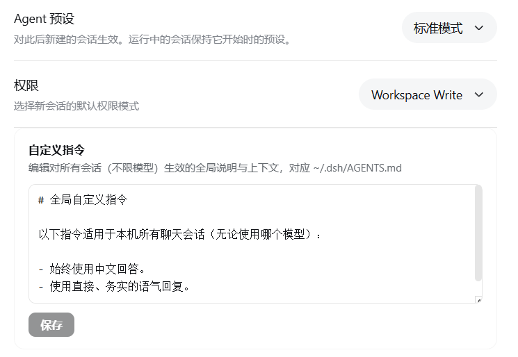

# dsh-custom-instructions

类 Codex 自定义指令：在设置里编辑一份**全局指令**，对本机所有会话、所有模型生效。

就像 Codex 的全局 `AGENTS.md` / ChatGPT 的 Custom Instructions 一样，你在「自定义指令」面板里写下的说明与上下文，会成为之后每次对话都自动携带的指导信息——不用再逐条重复交代。



## 功能 / Features

- **类 Codex 自定义指令**：设置 → 通用设置 →「自定义指令」，编辑 `~/.dsh/AGENTS.md`，保存即写盘。
- **所有会话、所有模型生效**：基于 DSH 内置 `dsh-agent-instructions` 机制，新会话第一条消息即携带；当前会话在下次文件操作后感知。
- **所见即所得**：等宽字体编辑框回显文件内容，保存后即时反馈成功/失败。
- **零构建**：Client 为手写 `window.__ModuleLoader__.load` bundle，Host 为纯 Node ESM，安装无需构建授权。

## 安装 / Install

### 从 GitHub 安装（本仓库）

```bash
dsh plugin --profile web add github:YOUR_OWNER/dsh-custom-instructions
```

然后重启一次 `dsh web`，让 bundle 层生效。

### 手动安装（改 profile 文件）

1. 添加依赖：

```jsonc
// ~/.dsh/profiles/web/package.json
{
  "dependencies": {
    "dsh-custom-instructions": "github:YOUR_OWNER/dsh-custom-instructions"
  }
}
```

2. 挂载插件行（也可以直接运行上面的 `dsh plugin` 命令自动完成）：

```yaml
# ~/.dsh/profiles/web/cordis.patch.yml
- insert:
    - id: custom-instructions
      name: dsh-custom-instructions
```

3. 在 profile 目录执行 `pnpm install`，然后重启 `dsh web`。

## 原理 / How it works

| 层 | 文件 | 作用 |
| --- | --- | --- |
| Host | `lib/index.js` | 在 webServer 注册 `GET/POST /custom-instructions` 路由，读写 `~/.dsh/AGENTS.md`；路径经 `@deepseek-ai/dsh-home-paths` 解析，与 `dsh-agent-instructions` 读取的是同一个文件 |
| Client | `lib/client.js` | 注册通用设置插槽 `settings.general.item`（id `custom-instructions`，位于「权限」下方）；打开面板时 `fetch` 读取，点保存时 `POST` 写回 |
| Bundle | `cordis.patch.yml` | 挂载两个半边的 loader 行 |

**生效机制**：面板修改的就是 `dsh-agent-instructions` 注入每个会话的全局指令文件，因此无需插件自己做热重载——新会话立即生效，当前会话在下次 `read` / `write` / `edit` 文件操作后感知。

## 兼容性 / Compatibility

- DeepSeek Harness `0.1.0-rc.6`（web profile）。
- 依赖 DSH 内置的 `dsh-agent-instructions`（`standard` 预设默认携带）；若你的 profile 禁用了它，指令不会注入。

## 开发 / Development

Client bundle 为手写 `window.__ModuleLoader__.load({ id, factory })` 线格式，无需构建：

```bash
node --check lib/index.js
node --check lib/client.js
```

## License

MIT
